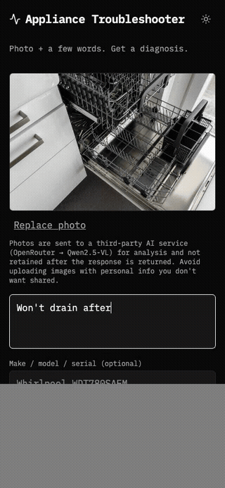

# Appliance Troubleshooter

Public, free, mobile-first web app: photo of a malfunctioning home appliance + a few words of context → structured diagnosis with appliance ID, ranked failure modes, DIY recovery steps with difficulty levels, "call a pro" recommendation when warranted, parts list, alternatives, and verification checks.

Second instance of the **Vision-LLM as Ambient Domain Expert** pattern (see `docs/superpowers/specs/2026-05-11-appliance-troubleshooter-design.md`). Plant Doctor was the first; the pattern + scaffolding compound across instances.



## Stack

SvelteKit (Svelte 5) + TypeScript on Cloudflare Workers + Static Assets. OpenRouter (default Qwen2.5-VL 72B) for diagnosis. KV for result persistence. Turnstile for abuse protection. Light hand-curated reference data table (~34 failure modes across 5 categories) injected into the system prompt. Tailwind v4 + Lucide + IBM Plex Mono with dark-default theme. No DB, no accounts, no image storage server-side — photos are forwarded to OpenRouter for the diagnosis call and not retained after the response.

## Dev

```bash
cp .dev.vars.example .dev.vars
# Fill in OPENROUTER_API_KEY

cp .env.example .env
# .env contains PUBLIC_TURNSTILE_SITE_KEY (test value works for local dev)

npm install
npm run dev
```

Visit `http://localhost:5173`.

## Tests

```bash
npm run test:unit          # Vitest
npm run test:e2e           # Playwright (auto-builds)
npm test                   # both
npm run quality            # manual quality runner against the fixture set (requires OPENROUTER_API_KEY)
```

## Deploy

1. `wrangler kv namespace create slop-appliance-doctor-DIAGNOSES` → update `wrangler.toml` with the namespace IDs
2. Get real Turnstile site + secret keys from CF dashboard
3. Put real site key in `.env` (`PUBLIC_TURNSTILE_SITE_KEY=...`)
4. `wrangler secret put OPENROUTER_API_KEY` and `wrangler secret put TURNSTILE_SECRET_KEY`
5. `npm run build && npx wrangler deploy`

## Cost & abuse controls

> ⚠️ **Read before changing these values.** This is the only thing standing between your OpenRouter account and a runaway bill if the URL gets shared somewhere unfriendly. The defaults are intentionally conservative.

Layered (env-tunable in `wrangler.toml [vars]` for non-secrets):
- Turnstile captcha — blocks bots before any LLM call
- Per-IP hourly rate limit (default 10/hour, `RATE_LIMIT_PER_HOUR`)
- Per-IP daily cap (default 50/day, `DAILY_CAP_PER_IP`)
- **Global daily budget cap** (default $10 USD/day, `DAILY_BUDGET_CENTS=1000`) — hard ceiling. Each request reserves an estimated 30¢ in KV *before* calling OpenRouter; when reservations exhaust the cap, the API returns 503 until the next UTC day. With Qwen2.5-VL at current pricing (~0.5¢/call), the 30¢ reservation gives ~60× headroom for model-price drift.

With defaults, the **maximum loss per month is ~$300** (=$10 × 31 days). If you raise `DAILY_BUDGET_CENTS`, you're proportionally raising the worst case. The MIT license disclaims liability; you own the cap you set.

## Reference data

`src/lib/referenceData.ts` is a hand-curated table of top failure modes per appliance category (dishwasher / washer / dryer / refrigerator / oven). Add entries as the quality runner reveals misses. See the file's structure for the schema.

## Style system

Tailwind v4 + Lucide icons + IBM Plex Mono. Dark default with a sun/moon toggle (persisted in `localStorage`). Mono + functional accents palette: grayscale base, red/amber/green only for semantic signals (danger / warning / success). Component primitives in `src/lib/components/` (`ThemeToggle`, `PageHeader`, `Pill`, `Callout`) and theme tokens in `src/app.css`.

## Docs

- Design spec: `docs/superpowers/specs/2026-05-11-appliance-troubleshooter-design.md`
- Pattern + sibling instances: tracked in a private idea-management repo
